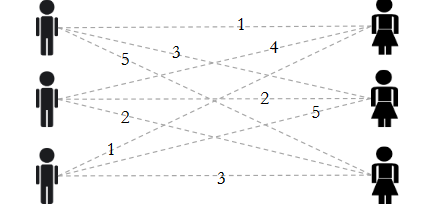
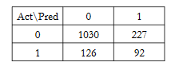

```{r setup, cache = FALSE, echo = FALSE, message = FALSE, warning = FALSE, tidy = FALSE}
require(knitr)
options(width = 200, scipen = 5)
options(dplyr.print_max = 200)
# options(width = 100, digits = 7)
opts_chunk$set(message = FALSE, error = FALSE, warning = FALSE, 
               collapse = TRUE, tidy = FALSE,
               cache = TRUE, cache.path = '.cache/', 
               fig.align = 'left', dpi = 100, fig.path = 'figures/Introductiontotextanalytics/')
# opts_chunk$set(dev="png", 
#                dev.args=list(type="cairo"),
#                dpi=96)
```
## Maximizing the Probability of Love

### About eHarmony

* Goal: take a scientific approach to love and marriage and offer it to the masses through an online dating website focused on extra long term relationships

* Successful at matchmaking
    + Nearly 4% of US marriages in 2012 are a result of eHarmony

* Successful business
    + Has generated over $1 billion in cumulative revenue

### The eHarmony Differences

* Unlike other online dating websites, eHarmony does not have users browse others' profiles

* Instead, eHarmony computes a compatibility score between two people and uses optimization algorithms to determine their users' best matches

### eHarmony's Compatibility Score

* Based on 29 different "dimensions of personality" including character, emotions, values, traits, etc.

* Assessed through a 436 question questionnaire

* Matches must meet >25/29 compatibility areas

### Dr. Neil Clark Warren

* Clinical psychologist who counseled couples and began to see that many marriages ended in divorce because couples were not initially compatible

* Has written many relationship books: "Finding the Love of Your Life", "The Triumphant Marriage", "Learning to Live with the Love of Your Life and Loving it", "Finding Commitment", and others

### Research -> Business

* In 1997, Warren began an extensive research project interviewing 5000+ couples across the US, which became the basis of eHarmony's compatibility profile

* [www.eHarmony.com](www.eHarmony.com) went live in 2000

* Interested users may fill out the compatibility quiz, but in order to see matches, members must pay a membership fee to eHarmony

### eHarmony Stands Out From the Crowd

* eHarmony was not the first online dating website and faced serious competition

* Key difference from other dating websites: takes a quantitative optimization approach to matchmaking, rather than letting users browse

### Integer Optimization Example

* Suppose we have three men and three women

* Compatibility score between 1 and 5 for all pairs

<center>


</center>

* How should we match pairs together to maximize compatibility?

<center>


</center>

### Data and Decision Variables

* Decision variables: Let \(x_{ij}\) be a binary variable taking value 1 if we match user \(i\) and \(j\) together and value 0 otherwise

* Data: Let \(u_{ij}\) be the compatibility score between user \(i\) and \(j\)

<center>



</center>

### Objective Function

* Maximize compatibility between matches:
max \(w_{11}x_{11} + w_{12}x_{12} + w_{13}x_{13} + w_{21}x_{21} + ... + w_{33}x_{33}\)

<center>


</center>

### Constraints

* Match each man to exactly one woman:

$$ x_{11} + x_{12} + x_{13} = 1$$

* Similarly, match each woman to exactly one man:

$$ x_{11} + x_{21} + x_{31} = 1$$
### Full Optimization Problem

max 

$$w_{11}x_{11} + w_{12}x_{12} + w_{13}x_{13} + w_{21}x_{21} + ... + w_{33}x_{33}$$


subject to: 

**Match every man to exactly one woman**

$$ x_{11} + x_{12} + x_{13} = 1 $$
$$ x_{21} + x_{22} + x_{23} = 1 $$
$$ x_{31} + x_{32} + x_{33} = 1 $$

** Match every woman to exactly one man**

$$ x_{11} + x_{21} + x_{31} = 1 $$

$$ x_{12} + x_{22} + x_{32} = 1 $$

$$ x_{13} + x_{23} + x_{33} = 1 $$

All are binary variables.

### Extend to Mutliple Matches

* Show woman 1 her top two males matches:

$$ x_{11} + x_{21} + x_{31} = 2$$

<center>


</center>

### Compatibility Scores

* In the optimization problem, we assumed the compatibility scores were data that we could input directly into the optimization model

* But where do these scores come from?

* "Opposites attract, then they attack" - Neil Clark Warren

* eHarmony's compatibility match score is based on similarity between users' answers to the questionnaire

### Predictive Model

* Public data set from eHarmony containing features for ~275,000 users and binary compatibility results from an interaction suggested by eHarmony

* Feature names and exact values are masked to protect users' privacy

* Try Logistic regression pairs of users' differences to predict compatibility

### Reduce the Size of the Problem

* Filtered the data to include only users in the Boston area who had compatibility scores listed in the dataset

* Computed absolute difference in features for these 1475 pairs

* Trained a logistic regression model on these differences

### Prediciting Compatibility is Hard!

* If we use a low threshold we will predict more false positive but also get more true positives

* Classification matrix for threshold = 0.2:

<center>



</center>

* Model AUC = 0.685

<center>


</center>


### Other Potential Techniques

* Trees
    + Especially useful for predicting compatibility if there are nonlinear relationships between variables
    
* Clustering
    + User segmentation

* Text Analytics
    + Analyze the text of users' profiles

* And much more...

### Feature Importance: Distance

<center>


</center>

### Feature Importance: Attractiveness

<center>


</center>

### Feature Importance: Height Differences

<center>


</center>

### How Successful is eHarmony?

* By 2004, eHarmony had made over $100 million in sales.

* In 2005, 90 eHarmony members married every day

* In 2007, 236 eHarmony members married every day

* In 2009, 542 eHarmony members married every day

### eHarmony Maintains its Edge

* 14% of the US online dating market.

* The only competitor with a large portion is Match.com with 24%

* Nearly 4% of US marriages in 2012 are a result of eHarmony

* eHarmony has successfully leveraged the power of analytics to create a successful and thriving business

